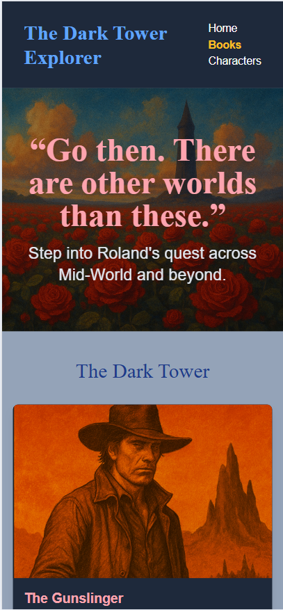

# The Dark Tower Explorer

A capstone project inspired by *The Dark Tower* universe created by Stephen King.

## Live Site

[View the Live Site on GitHub Pages](https://ellene-broome.github.io/dark-fantasy-journey/)

## Repository

[View the GitHub Repo](https://github.com/ellene-broome/dark-fantasy-journey)
---

## Mobile View

---

## Screenshots

---

## Capstone Requirements Checklist

| Requirement                            | Completed |
|----------------------------------------|-----------|
| Semantic HTML                          | ✅        |
| Tailwind CSS (CDN)                     | ✅        |
| Mobile-first responsive layout         | ✅        |
| JavaScript: functions, arrays, DOM     | ✅        |
| Public API used (Open Library)         | ✅        |
| GitHub Pages deployment                | ✅        |
| Repo and live site linked              | ✅        |
| Git commit history shown               | ✅        |
| Screenshots, presentation ready        | ✅        |

---

## Project Timeline

Tracked using GitHub Projects  
[View My Capstone Project Board](https://github.com/users/ellene-broome/projects/5/views/1?system_template=kanban)

---

## Credits

- **Stephen King** – for the *Dark Tower* universe  
- **ChatGPT + Ellene Broome** – AI-generated book cover art  
- **Class Demo Repo** – [`library-demo`](https://github.com/thomas-basham/library-demo)  
- **Instructor** – Thomas Basham

---

## Author

Ellene R. Broome  
Student, Web Development Capstone – July 2025  
[GitHub Profile → ellene-broome](https://github.com/ellene-broome)
