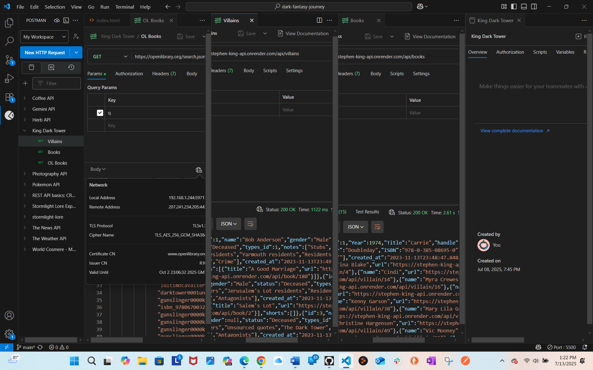

# 🌌 The Dark Tower Explorer

A capstone project inspired by *The Dark Tower* universe created by Stephen King.

## 🔍 Overview
This web application allows users to explore characters, books, and the world of *The Dark Tower* saga. It demonstrates core web development skills, including:

- Semantic HTML5
- Tailwind CSS (mobile-first, responsive design)
- Vanilla JavaScript (functions, DOM manipulation, array methods)
- Dynamic content rendering
- Local images and user interaction
- Public API integration (optional)

---

## 🌐 Live Site  
[View the Live Site](https://coming/)

## 📁 Repository  
[View the GitHub Repo](https://github.com/coming/dark-tower-explorer)

## Screenshots  
  

---

## 🛠️ Features
- Character filtering & book previews
- Book summaries rendered from an array
- "Show more" interactive sections
- Responsive Tailwind layout
- Custom color palette inspired by a Dark Tower retro poster
- Locally stored images

---

## 🎬 Credits
- Stephen King – for the *Dark Tower* universe  
- AI Image by ChatGPT & User  
- Inspired by class repo: [`library-demo`](https://github.com/thomas-basham/library-demo)  
- Instructor: Thomas Basham  

---

## ✅ Capstone Requirements Checklist

| Requirement                            | Completed |
|----------------------------------------|-----------|
| Semantic HTML                          |         |
| Tailwind CSS (CDN)                     |         |
| Mobile-first responsive layout         |         |
| JavaScript: functions, arrays, DOM     |         |
| Public API used (or local array)       |         |
| GitHub Pages deployment                |         |
| Repo and live site linked              |         |
| Git commit history shown               |         |
| Screenshots, presentation ready        |         |

---

## 🗂️ Project Timeline  
Tracked using GitHub Projects.  
[View My Project Board](https://github.com/users/ellene-broome/projects/5/views/1?system_template=kanban)

---

## 🧪 Future Features (Optional Ideas)
- API for quotes or characters
- Page transitions using JS
- Sound effects on hover
- Sorting or category tags

---

## 👩🏼‍💻 Author  
Ellene R. Broome  
Student, Web Development Capstone – July 2025
